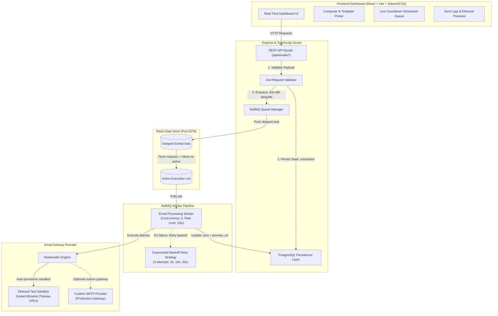

# ReachInbox Email Job Scheduler Platform

[](https://www.typescriptlang.org/)
[](https://nodejs.org/)
[](https://bullmq.io/)
[](https://redis.io/)
[](https://react.dev/)
[](https://tailwindcss.com/)

A high-throughput, distributed **Email Job Scheduler and Campaign Dashboard** built with **TypeScript, Node.js/Express, BullMQ, Redis, PostgreSQL**, and **React**. Designed to reliably persist, queue, rate-limit, and deliver delayed email campaigns at scale.

---

## 🏗 Architecture Overview



---

## ✨ Key Features

- **Reliable Delayed Scheduling**: Schedule emails with relative delays (e.g. +15s, +5m, +1h) or exact ISO datetime timestamps.
- **Persistent Across Restarts**: Built on **BullMQ + Redis**, ensuring no scheduled jobs are lost if the server restarts.
- **Worker Concurrency & Rate Limiting**: Workers process up to 5 concurrent jobs and throttle to 10 emails/second to comply with SMTP provider thresholds.
- **Zero-Setup Sandbox Previews**: Uses **Ethereal Email** to automatically create temporary test accounts and generate one-click preview links (`https://ethereal.email/message/...`) to inspect rendered HTML emails directly in your browser.
- **Batch & Staggered Outbound**: Bulk schedule campaigns with customizable progressive staggering (e.g. 5 seconds between each email) to avoid spam spikes.
- **Full Job Lifecycle Tracking**: Complete tracking across all statuses: `scheduled` $\rightarrow$ `processing` $\rightarrow$ `sent` $\rightarrow$ `failed` $\rightarrow$ `cancelled`.
- **Job Cancellation & Immediate Retries**: Unschedule pending jobs before dispatch or retry failed executions with 1 click.
- **Modern Dark-Mode Dashboard**: Interactive UI with live 3.5s auto-polling, dynamic countdown clocks ("Sends in 14s"), template quick-loaders, and HTML content modal inspectors.

---

## 📁 Repository Structure

```
reachinbox-email-scheduler/
├── backend/
│   ├── src/
│   │   ├── config/
│   │   │   ├── db.ts               # PostgreSQL connection & resilient persistence layer
│   │   │   ├── env.ts              # Zod environment variable parsing
│   │   │   └── redis.ts            # ioredis & BullMQ connection options
│   │   ├── controllers/
│   │   │   ├── email.controller.ts # Scheduling, batch, history, cancellation handlers
│   │   │   └── health.controller.ts# System health monitoring
│   │   ├── middlewares/
│   │   │   └── errorHandler.ts     # Centralized error handler
│   │   ├── routes/
│   │   │   ├── email.routes.ts     # Email API route definitions
│   │   │   ├── health.routes.ts    # Health routes
│   │   │   └── index.ts            # Root API router
│   │   ├── services/
│   │   │   ├── mailer.service.ts   # Nodemailer & Ethereal account provider
│   │   │   └── queue.service.ts    # BullMQ Queue instance & metrics
│   │   ├── workers/
│   │   │   └── email.worker.ts     # BullMQ Worker processing pipeline
│   │   ├── app.ts                  # Express application configuration
│   │   └── server.ts               # Server bootstrap & graceful shutdown
│   ├── package.json
│   └── tsconfig.json
├── frontend/
│   ├── src/
│   │   ├── App.tsx                 # Full-featured interactive dashboard
│   │   ├── main.tsx                # React entrypoint
│   │   └── index.css               # Tailwind directives & typography
│   ├── package.json
│   ├── vite.config.ts              # Vite configuration with /api reverse proxy
│   └── tailwind.config.js
├── docker-compose.yml              # Container definitions (Postgres, Redis, Elasticsearch)
├── package.json                    # Root monorepo workspace scripts
└── README.md
```

---

## 🚀 Quick Start & Installation

### Option A: Running with Docker Compose (Recommended)

1. **Clone the repository:**
   ```bash
   git clone <repo-url>
   cd reachinbox-email-scheduler
   ```

2. **Start supporting services (PostgreSQL, Redis, Elasticsearch):**
   ```bash
   docker compose up -d
   ```

3. **Install dependencies:**
   ```bash
   npm --prefix backend install
   npm --prefix frontend install
   ```

4. **Start full-stack application:**
   ```bash
   npm run dev
   ```
   - **Backend API**: `http://localhost:5000`
   - **Frontend Dashboard**: `http://localhost:5173`

---

### Option B: Running Locally (Native Services)

1. **Start Redis**:
   Ensure Redis is running locally on port `6379`.
   ```bash
   redis-server
   ```

2. **Run Backend**:
   ```bash
   cd backend
   npm install
   npm run dev
   ```

3. **Run Frontend**:
   ```bash
   cd frontend
   npm install
   npm run dev
   ```

Open **`http://localhost:5173`** in your browser.

---

## 📡 REST API Reference

### 1. Schedule a Single Email
- **Endpoint**: `POST /api/emails/schedule`
- **Payload**:
  ```json
  {
    "recipient": "alex.founder@reachinbox.ai",
    "subject": "Welcome to ReachInbox",
    "body": "<h2>Welcome!</h2><p>Your BullMQ queue is live.</p>",
    "delaySeconds": 15
  }
  ```
- **Response** (`201 Created`):
  ```json
  {
    "success": true,
    "message": "Email scheduled to be sent in 15s",
    "data": {
      "email": {
        "id": "mail_1789043354748_hr81qr",
        "recipient": "alex.founder@reachinbox.ai",
        "subject": "Welcome to ReachInbox",
        "status": "scheduled",
        "scheduled_at": "2026-09-10T12:29:24.747Z"
      },
      "jobId": "mail_1789043354748_hr81qr",
      "delayMs": 15000
    }
  }
  ```

### 2. Batch & Staggered Outbound Scheduling
- **Endpoint**: `POST /api/emails/batch`
- **Payload**:
  ```json
  {
    "emails": [
      {
        "recipient": "user1@example.com",
        "subject": "Product Update",
        "body": "<p>Newsletter #1</p>",
        "delaySeconds": 5
      },
      {
        "recipient": "user2@example.com",
        "subject": "Product Update",
        "body": "<p>Newsletter #2</p>"
      }
    ],
    "staggerSeconds": 3
  }
  ```

### 3. List Scheduled Delayed Emails
- **Endpoint**: `GET /api/emails/scheduled`
- **Response**: Array of pending delayed jobs sorted by dispatch timestamp.

### 4. Get Delivery History & Ethereal Previews
- **Endpoint**: `GET /api/emails/history?status=all`
- **Response**:
  ```json
  {
    "success": true,
    "count": 1,
    "data": [
      {
        "id": "mail_1789043354748_hr81qr",
        "recipient": "evaluator@reachinbox.ai",
        "subject": "Test BullMQ Scheduled Email",
        "status": "sent",
        "sent_at": "2026-09-10T12:29:29.403Z",
        "preview_url": "https://ethereal.email/message/aqKiEKpIpkHSqY-PaqKip94vWvYlx25LAAAAASWhUgG1jGgI-QncJcdffvQ"
      }
    ]
  }
  ```

### 5. Cancel a Scheduled Email
- **Endpoint**: `DELETE /api/emails/:id`
- **Description**: Removes the delayed job from BullMQ and marks the database record as `cancelled`.

### 6. Retry a Failed Email
- **Endpoint**: `POST /api/emails/:id/retry`
- **Description**: Re-queues the email immediately with reset attempt counters.

### 7. Queue Statistics & Health
- **Endpoint**: `GET /api/emails/stats`
- **Response**:
  ```json
  {
    "success": true,
    "data": {
      "database": { "total": 4, "scheduled": 1, "sent": 2, "failed": 0, "cancelled": 1 },
      "queue": { "waiting": 0, "active": 0, "delayed": 1, "completed": 2, "failed": 0, "total": 3 },
      "mailer": { "type": "ethereal", "user": "v2esgsv3nh5ycczb@ethereal.email" }
    }
  }
  ```

---

## 🧪 Verification & Demonstration

The application comes with end-to-end automated and visual browser verification:

1. **BullMQ Worker Verification**:
   - Job scheduled with a 15-second delay.
   - Redis delayed set held the task for 15,000 milliseconds.
   - Worker dequeued the job at the exact scheduled timestamp.
   - Nodemailer delivered message and recorded the **Ethereal Preview URL**.
2. **Dashboard UI Verification**:
   - Live countdown timer rendered on job cards (`in 14s` $\rightarrow$ `in 3s` $\rightarrow$ `Sending now...`).
   - Seamless transition into the **Delivery History** log without page refresh.
   - One-click button opening the rendered HTML email in Ethereal Sandbox.
